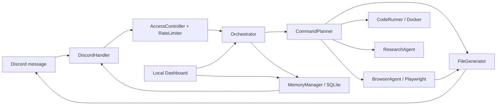

# 龙焱 / 天机 - Longyan / Tianji

<p align="center">
  
</p>

[](https://nodejs.org/)
[](https://discord.js.org/)
[](https://playwright.dev/)
[](https://www.docker.com/)
[](https://sqlite.org/)
[](#longyan--tianji)
[](#longyan--tianji)
[](#local-dashboard)
[](#security-posture)
[](LICENSE)

Longyan is the command engine. Tianji is the Discord operator that sits on top of it.

The system turns Discord messages into controlled automation tasks. It can open pages, read public content, click and fill browser flows, run short Python or JavaScript snippets in Docker, generate PDF/Excel/image/JSON artifacts, keep scoped memory, and return configurable concise results to Discord.

This repository has been hardened after a source-code audit. The default posture is now defensive: operational commands require an allowlist, Docker code execution starts without network access, browser automation blocks private networks, browser `eval` is disabled, and generated artifacts are size-limited and kept inside a managed temp directory.

## Security Audit

An enterprise source-code audit by 安恒信息 is available in the repository:

[AH-CODE-2026-0042 - Longyan / Tianji 源代码安全审计报告](CODE_AUDIT_AH-CODE-2026-0042.md)

Audit identity:

| Field | Value |
| --- | --- |
| Reporting organization | 安恒信息 |
| Report number | AH-CODE-2026-0042 |
| Audit date | 2026年7月 |
| Audit object | Longyan / Tianji - automation task execution engine and Discord operator system |
| Audit type | Overall source-code security audit + manual function-point source-code audit |

## What It Does

Longyan / Tianji is useful when a trusted Discord workspace needs a compact automation operator:

| Capability | Description |
| --- | --- |
| Discord command intake | Prefix-based commands handled through Discord.js v14 with per-user reply modes |
| Task planning | Local command router splits chained user instructions into typed steps |
| Browser automation | Playwright Chromium opens pages, clicks, fills, reads text, extracts links, scrapes selectors, and captures screenshots |
| Code execution | Python and JavaScript snippets run inside short-lived Docker containers |
| File generation | PDF, `.xlsx`, PNG, and JSON artifacts can be generated and attached to Discord replies without forcing verbose JSON output |
| Research | Free public-web lookup through Wikipedia and DuckDuckGo, with optional SerpAPI bonus |
| Personal assistant | Persistent user profile with assistant name, user name, speaking style, personality, preferences, and long notes |
| Memory | SQLite stores task history, scoped key-value memory, and personal profiles |
| Local dashboard | Browser-based localhost GUI for profile editing, reply mode, memory, execution, research, config, and runtime usage |
| Operations | Queue, status, cancel, health, and session commands support operator workflows |

## Security Posture

The current default configuration is designed for controlled internal use.

| Area | Default |
| --- | --- |
| Discord command authorization | Allowlist required for non-public commands |
| Public commands | `help`, `ping`, and `name` may be public when `ALLOW_PUBLIC_COMMANDS=true` |
| Admin commands | `queue` and `health` require admin user or admin role allowlist |
| Direct messages | Disabled for operational commands |
| Browser private network access | Blocked |
| Browser JavaScript `eval` | Disabled |
| Chromium sandbox | Enabled by default |
| Browser context reuse | Disabled; every task gets a fresh context |
| Docker network | `none` by default |
| Docker image auto-pull | Disabled by default |
| Docker container privileges | Non-root user, read-only root filesystem, dropped capabilities, no-new-privileges |
| SQLite memory scope | User-scoped by default |
| Personal profile | Stored per user in SQLite |
| Public research | Free providers enabled; SerpAPI disabled by default |
| Local dashboard | Disabled by default and bound to localhost when enabled |
| Generated files | Written only inside the managed temp directory |
| Dependency audit | `npm audit` reports zero known vulnerabilities after the included lockfile is used |

## Architecture



The entry file only boots the runtime. Most behavior lives in small modules:

| File | Responsibility |
| --- | --- |
| `index.js` | Starts Discord, wires the runtime, handles shutdown |
| `src/config.js` | Reads environment variables and applies safe defaults |
| `src/security.js` | Discord allowlists, admin checks, memory scope prefixes, rate limiting |
| `src/discord-handler.js` | Commands, replies, ownership checks, attachment filtering |
| `src/command-planner.js` | Splits free-form commands into typed execution steps |
| `src/orchestrator.js` | Queue, task state, timeouts, cancellation, task persistence |
| `src/browser-agent.js` | Isolated Playwright contexts and URL/network controls |
| `src/code-runner.js` | Hardened Docker execution for Python and JavaScript snippets |
| `src/file-generator.js` | Safe artifact generation and temp-file cleanup |
| `src/research-agent.js` | Public web lookup providers |
| `src/memory.js` | SQLite task history and memory storage |
| `src/local-dashboard.js` | Localhost GUI and JSON API |
| `src/utils.js` | Parsing, clipping, redaction, path checks, formatting |
| `scripts/check.js` | Syntax verification for all JavaScript files |
| `scripts/gui.js` | Starts the local dashboard mode |

## Requirements

- Node.js 18 or newer
- npm
- Docker Engine for code execution
- Chromium installed through Playwright
- A Discord application and bot token for Discord mode
- A trusted Discord server, channel, user, or role allowlist

Discord is optional when running only the local dashboard with `npm run gui`.

## Install

```bash
npm ci
npx playwright install chromium
cp .env.example .env
npm run verify
```

If Docker images are not already present and `AUTO_PULL_IMAGES=false`, pull them once:

```bash
docker pull python:3.11-slim
docker pull node:20-slim
```

Then start:

```bash
npm start
```

For local development with restart-on-change:

```bash
npm run dev
```

For the local assistant dashboard:

```bash
npm run gui
```

This starts a localhost control panel. By default it opens `http://127.0.0.1:3010/` and can run even when `DISCORD_TOKEN` is not set.

## First Configuration

Copy `.env.example` to `.env`, then set at least:

```env
DISCORD_TOKEN=your_discord_bot_token
DISCORD_CLIENT_ID=your_discord_client_id
ALLOWED_GUILD_IDS=your_server_id
ALLOWED_CHANNEL_IDS=your_command_channel_id
ALLOWED_USER_IDS=your_discord_user_id
ADMIN_USER_IDS=your_discord_user_id
```

Important: with `SECURITY_REQUIRE_ALLOWLIST=true`, Tianji will reject operational commands until at least one allowed user, role, or admin is configured.

## Environment Reference

### Discord Identity

| Variable | Default | Purpose |
| --- | --- | --- |
| `DISCORD_TOKEN` | empty | Discord bot token. Required to start. |
| `DISCORD_CLIENT_ID` | empty | Discord application client ID. |
| `COMMAND_PREFIX` | `!` | Prefix used for text commands. |
| `PROJECT_NAME` | `Longyan` | Human-readable engine name. |
| `BOT_NAME` | `Tianji` | Human-readable operator name. |

### Access Control

| Variable | Default | Purpose |
| --- | --- | --- |
| `SECURITY_REQUIRE_ALLOWLIST` | `true` | Requires explicit user or role allowlist for operational commands. |
| `ALLOW_PUBLIC_COMMANDS` | `true` | Lets `help`, `ping`, and `name` work without allowlist. |
| `ALLOW_DIRECT_MESSAGES` | `false` | Blocks operational commands in DMs. |
| `ALLOWED_GUILD_IDS` | empty | Comma-separated server IDs allowed to use the bot. Empty means no guild filter. |
| `ALLOWED_CHANNEL_IDS` | empty | Comma-separated channel IDs allowed to use the bot. Empty means no channel filter. |
| `ALLOWED_USER_IDS` | empty | Comma-separated user IDs allowed to run normal commands. |
| `ALLOWED_ROLE_IDS` | empty | Comma-separated role IDs allowed to run normal commands. |
| `ADMIN_USER_IDS` | empty | Comma-separated user IDs allowed to run admin commands and inspect any task. |
| `ADMIN_ROLE_IDS` | empty | Comma-separated role IDs allowed to run admin commands and inspect any task. |
| `RATE_LIMIT_WINDOW_MS` | `60000` | Per-user rate limit window. |
| `RATE_LIMIT_MAX_COMMANDS` | `12` | Max commands per user per rate-limit window. |
| `BYPASS_RATE_LIMIT_FOR_ADMINS` | `true` | Lets admins bypass the per-user command rate limit. |

### Task Budgets

| Variable | Default | Purpose |
| --- | --- | --- |
| `MAX_CONCURRENT_TASKS` | `4` | Global concurrent task limit. |
| `MAX_QUEUE_SIZE` | `50` | Global queued task limit. |
| `MAX_QUEUED_TASKS_PER_USER` | `3` | Active plus queued tasks allowed per user. |
| `MAX_COMMAND_CHARS` | `6000` | Max Discord command payload length. |
| `MAX_PLAN_STEPS` | `6` | Max chained execution steps in one command. |
| `TASK_TIMEOUT_MS` | `120000` | Whole-task timeout. |
| `REPLY_WAIT_MS` | `60000` | How long Discord waits before returning a queued task ID. |
| `CODE_TIMEOUT_MS` | `30000` | Docker code execution timeout. |
| `CODE_MAX_CHARS` | `12000` | Max inline code payload length. |
| `CODE_MAX_OUTPUT_CHARS` | `12000` | Max Docker stdout/stderr returned to Discord. |

### Docker Sandbox

| Variable | Default | Purpose |
| --- | --- | --- |
| `DOCKER_SOCKET` | platform default | Docker socket path. Uses `/var/run/docker.sock` on Linux/macOS and `//./pipe/docker_engine` on Windows. |
| `DOCKER_NETWORK` | `none` | Network mode for code containers. Keep `none` for untrusted code. |
| `AUTO_PULL_IMAGES` | `false` | Auto-pulls missing images. Enable only in reviewed environments. |
| `PYTHON_IMAGE` | `python:3.11-slim` | Python runtime image. Pin by digest for production. |
| `NODE_IMAGE` | `node:20-slim` | JavaScript runtime image. Pin by digest for production. |
| `DOCKER_RUN_USER` | `1000:1000` | User used inside code containers. |
| `DOCKER_MEMORY_MB` | `512` | Container memory and swap cap. |
| `DOCKER_CPU_QUOTA` | `50000` | CPU quota with `CpuPeriod=100000`. |
| `DOCKER_PIDS_LIMIT` | `128` | Process limit. |
| `DOCKER_TMPFS_SIZE_MB` | `64` | `/tmp` tmpfs size. |
| `DOCKER_READONLY_ROOTFS` | `true` | Uses a read-only root filesystem. |
| `DOCKER_CAP_DROP_ALL` | `true` | Drops all Linux capabilities. |
| `DOCKER_NO_NEW_PRIVILEGES` | `true` | Enables no-new-privileges. |

### Browser Automation

| Variable | Default | Purpose |
| --- | --- | --- |
| `BROWSER_HEADLESS` | `true` | Runs Chromium headless. |
| `BROWSER_DISABLE_SANDBOX` | `false` | Adds `--no-sandbox` only when explicitly enabled. Avoid in production. |
| `BROWSER_ALLOW_EVAL` | `false` | Allows `eval:` page execution. Keep disabled unless the bot is admin-only. |
| `BROWSER_ALLOW_PRIVATE_NETWORKS` | `false` | Allows localhost/private/internal IP access. Keep disabled. |
| `BROWSER_ALLOWED_HOSTS` | empty | Optional comma-separated host allowlist. Supports exact hosts and `*.example.com`. |
| `BROWSER_BLOCKED_HOSTS` | empty | Optional comma-separated host blocklist. |
| `BROWSER_TIMEOUT_MS` | `45000` | Playwright default timeout. |
| `BROWSER_WIDTH` | `1920` | Browser viewport width. |
| `BROWSER_HEIGHT` | `1080` | Browser viewport height. |
| `BROWSER_MAX_TEXT_CHARS` | `4000` | Max page text returned. |
| `BROWSER_MAX_LINKS` | `20` | Max links returned. |
| `BROWSER_MAX_SCREENSHOT_BYTES` | `8388608` | Max screenshot artifact size. |
| `BROWSER_FULL_PAGE_SCREENSHOTS` | `false` | Captures viewport only by default to avoid huge artifacts. |

### Memory

| Variable | Default | Purpose |
| --- | --- | --- |
| `MEMORY_DB_PATH` | `./longyan-memory.db` | SQLite database path. Must stay inside project root unless explicitly allowed. |
| `ALLOW_MEMORY_DB_OUTSIDE_ROOT` | `false` | Allows memory DB outside root after review. |
| `MEMORY_SCOPE` | `user` | One of `user`, `channel`, `guild`, `global`. |
| `MEMORY_MAX_VALUE_CHARS` | `200000` | Max value size for `!memory set`. |
| `MEMORY_LIST_LIMIT` | `20` | Max memory rows returned by `!memory list`. |

### Personal Assistant

| Variable | Default | Purpose |
| --- | --- | --- |
| `ASSISTANT_DEFAULT_BOT_NAME` | `BOT_NAME` | Default assistant name shown in profile-aware replies. |
| `ASSISTANT_DEFAULT_USER_NAME` | empty | Default way to address the user. |
| `ASSISTANT_DEFAULT_SPEAKING_STYLE` | `warm, concise, professional` | Default speaking style before the user customizes it. |
| `ASSISTANT_DEFAULT_PERSONALITY` | `Personal automation assistant with a calm enterprise tone.` | Default personality instruction. |
| `ASSISTANT_MAX_PROFILE_NOTES_CHARS` | `200000` | Max long-term profile notes stored per user. |
| `ASSISTANT_MAX_PREFERENCE_VALUE_CHARS` | `50000` | Max size of one saved preference value. |

### Files And Replies

| Variable | Default | Purpose |
| --- | --- | --- |
| `TEMP_DIR` | `./temp` | Managed artifact directory. Must stay inside project root unless explicitly allowed. |
| `ALLOW_TEMP_DIR_OUTSIDE_ROOT` | `false` | Allows external temp directory after review. |
| `TEMP_FILE_TTL_MS` | `86400000` | Temp artifact retention before cleanup. |
| `DEFAULT_REPLY_MODE` | `summary` | Default Discord result mode: `summary`, `files`, `json`, or `silent`. |
| `MAX_REPLY_CHARS` | `1800` | Max result block size before clipping. |
| `MAX_ATTACHMENT_FILES` | `8` | Max files attached in one Discord reply. |
| `MAX_ATTACHMENT_BYTES` | `8388608` | Max attachment size accepted for return. |
| `MAX_FILE_INPUT_CHARS` | `100000` | Max content size for generated files. |

### Research

| Variable | Default | Purpose |
| --- | --- | --- |
| `FREE_SEARCH_ENABLED` | `true` | Enables free search providers. |
| `SERPAPI_ENABLED` | `false` | Enables SerpAPI only when deliberately requested. |
| `SERPAPI_KEY` | empty | Optional SerpAPI key. The assistant works without it. |
| `RESEARCH_TIMEOUT_MS` | `12000` | HTTP timeout for each research provider. |
| `RESEARCH_MAX_RESULTS` | `5` | Max results per provider. |

### Local Dashboard

| Variable | Default | Purpose |
| --- | --- | --- |
| `LOCAL_DASHBOARD_ENABLED` | `false` | Starts the localhost GUI with `npm start`. |
| `LOCAL_DASHBOARD_HOST` | `127.0.0.1` | Bind address. Keep localhost unless reviewed. |
| `LOCAL_DASHBOARD_PORT` | `3010` | Dashboard port. |
| `LOCAL_DASHBOARD_OPEN` | `false` | Opens the dashboard in the default browser when it starts. |
| `LOCAL_DASHBOARD_TOKEN` | empty | Optional API token for the dashboard. |
| `LOCAL_DASHBOARD_USER_ID` | `local-user` | Default local profile ID. |
| `LOCAL_DASHBOARD_MAX_BODY_CHARS` | `1000000` | Max local API request size. |

## Commands

### Utility

```text
!help
!ping
!name
!output
!output files
!output summary
!output json
!output silent
!code off
!code on
```

### Operations

```text
!health
!queue
!status task_id
!cancel task_id
!session
```

Notes:

- `!health` and `!queue` require admin allowlist.
- `!status task_id` and `!cancel task_id` only work for the task owner unless the caller is admin.
- `!session` shows the caller's session by default. Inspecting another session requires admin allowlist.

### Reply Modes

```text
!output files
!output summary
!output json
!output silent
!assistant output files
!code off
!code on
```

Reply mode is saved in the user's assistant profile as `reply_mode`.

| Mode | Behavior |
| --- | --- |
| `files` | Sends attachments first with a short status line. This is the best mode for PDF, Excel, image, and JSON artifact workflows when you do not want the verbose result payload. |
| `summary` | Sends a short readable result with filenames and step summaries. |
| `json` | Sends the full debug payload in a JSON block. Useful while developing commands. |
| `silent` | Sends only the task status and ID, while still attaching eligible files. |

`!code off` is a fast shortcut for `!output files`. `!code on` switches back to `!output json`.

### Memory

```text
!memory set project Longyan
!memory get project
!memory list
!memory delete project
```

Memory is scoped by `MEMORY_SCOPE`. The default `user` scope prevents one user from listing another user's memory entries.

### Personal Assistant Profile

```text
!assistant show
!assistant rename Tianji
!assistant call-me Boss
!assistant style warm, concise, direct
!assistant personality serious Chinese enterprise assistant
!assistant notes user likes short operational answers
!assistant output files
!assistant remember timezone Europe/Paris
!assistant forget timezone
!remember preferred_language English
```

The profile is stored in SQLite and follows the user. It includes the assistant name, the name it should use for the user, speaking style, personality, long-term notes, reply mode, and structured preferences.

### Browser Work

```text
!exec open https://example.com screenshot
!exec open github.com scrape selector:h1
!exec open example.com links
!exec open example.com page text
!exec open example.com fill:"#search" text:"discord bot" press:Enter
```

Browser safety notes:

- Private, local, link-local, and metadata-service IPs are blocked unless `BROWSER_ALLOW_PRIVATE_NETWORKS=true`.
- `eval:` is rejected unless `BROWSER_ALLOW_EVAL=true`.
- Every browser task gets a fresh context, so cookies and page state do not leak between tasks.
- Screenshots are viewport-only by default.

### Code Execution

```text
!exec run python code: print(sum(range(100)))
!exec run javascript code: console.log(new Date().toISOString())
```

Code safety notes:

- Code runs in Docker, not in the Node.js bot process.
- Containers are short-lived and removed after execution.
- Network is disabled by default with `DOCKER_NETWORK=none`.
- Output, code length, CPU, memory, process count, and runtime are capped.

### File Generation

```text
!exec generate pdf content:"Daily brief"
!exec create excel data:[{"name":"Longyan","role":"project"},{"name":"Tianji","role":"operator"}]
!exec make image text:"Longyan Tianji"
!exec export json data:{"project":"Longyan","bot":"Tianji"}
```

File safety notes:

- Generated files are written only inside `TEMP_DIR`.
- Attachment size and count are limited.
- Use `!output files` or `!code off` when you want only a short completion line and the attached file, without the full JSON result block.
- Excel values starting with `=`, `+`, `-`, or `@` are escaped to reduce formula injection risk.
- Old temporary artifacts are pruned by TTL.

### Research

```text
!exec research public web for browser automation
!exec search wikipedia for command queue design
```

Research is free-first. Wikipedia, DuckDuckGo Instant Answer, and DuckDuckGo HTML search work without any key. SerpAPI is only used when both `SERPAPI_KEY` and `SERPAPI_ENABLED=true` are configured.

### Chained Work

```text
!exec open https://example.com screenshot then generate pdf content:"Captured example.com"
!exec run python code: print("ready") then create excel data:[{"status":"ready"}]
```

Chained commands are limited by `MAX_PLAN_STEPS`.

## Local Dashboard

The project includes a localhost GUI for a more personal assistant experience:

```bash
npm run gui
```

The dashboard lets you:

- Chat with the command engine from the browser.
- Rename the assistant.
- Set how the assistant should call you.
- Change the speaking style and personality in real time.
- Switch Discord reply mode between summary, files, JSON, and silent.
- Store long-term notes and preferences.
- Add and list local memory.
- Run research without SerpAPI.
- Inspect queue, task history, memory size, process memory, and runtime health.
- View redacted configuration.

Default URL:

```text
http://127.0.0.1:3010/
```

When `npm run gui` is used, the dashboard is enabled and opened automatically. If `DISCORD_TOKEN` is missing, the process still runs in local-dashboard-only mode. The interface uses a restrained Chinese enterprise style: flat panels, square controls, a discrete red seal accent, and a dense operational layout.

## Deployment Checklist

Before running outside a local test machine:

1. Set `SECURITY_REQUIRE_ALLOWLIST=true`.
2. Set at least one of `ALLOWED_USER_IDS`, `ALLOWED_ROLE_IDS`, `ADMIN_USER_IDS`, or `ADMIN_ROLE_IDS`.
3. Set `ALLOWED_GUILD_IDS` and `ALLOWED_CHANNEL_IDS` for the trusted Discord workspace.
4. Keep `ALLOW_DIRECT_MESSAGES=false`.
5. Keep `DOCKER_NETWORK=none` unless the code sandbox is explicitly allowed to use the network.
6. Keep `AUTO_PULL_IMAGES=false` in production and pre-pull reviewed images.
7. Pin `PYTHON_IMAGE` and `NODE_IMAGE` by digest for production deployments.
8. Keep `BROWSER_ALLOW_PRIVATE_NETWORKS=false`.
9. Keep `BROWSER_ALLOW_EVAL=false` unless the bot is admin-only and the use case was reviewed.
10. Keep `BROWSER_DISABLE_SANDBOX=false`; if Chromium cannot start, fix the host/container profile rather than disabling sandboxing.
11. Keep `LOCAL_DASHBOARD_HOST=127.0.0.1` unless the dashboard is protected and reviewed.
12. Set `LOCAL_DASHBOARD_TOKEN` before exposing the dashboard beyond localhost.
13. Run `npm ci` and `npm run verify` in CI.
14. Back up or rotate `longyan-memory.db` according to your data retention policy.

## Hardening Notes

### Discord

The bot now applies an explicit command gate before operational commands run. It checks guild, channel, user, role, admin status, and per-user rate limits. Public commands are intentionally limited to low-risk helpers.

Longyan / Tianji primarily supports official Discord bot tokens. User token mode (selfbot) is available through `DISCORD_USER_TOKEN_MODE=true` but is against Discord Terms of Service and should only be used with full awareness of the risks. For a personal non-bot experience, the recommended approach is to use the local dashboard at `http://127.0.0.1:3010/`.

### Browser

The browser agent creates a new Playwright context for every task and closes it at the end. This avoids shared cookies, shared local storage, and accidental carry-over from earlier tasks. URL validation blocks non-HTTP(S) protocols and private network addresses by default.

### Docker

The code runner uses Docker as a containment layer. It sets a non-root user, read-only root filesystem, tmpfs `/tmp`, memory and CPU limits, PID limits, dropped capabilities, and no-new-privileges. The Docker socket itself is still a high-trust boundary; isolate the bot host or use a dedicated worker service when running in production.

### Files

Artifacts stay inside the managed temp directory. The Discord handler verifies that returned attachments still live under that directory and are below the configured size limit before sending them.

### Memory

SQLite queries use parameters. Memory keys are prefixed according to `MEMORY_SCOPE`, which defaults to per-user isolation. Assistant profiles are also stored per user and can hold long-term notes and structured preferences.

### Local Dashboard

The dashboard binds to `127.0.0.1` by default. Use `LOCAL_DASHBOARD_TOKEN` before binding it to another interface, because the dashboard can execute tasks, edit profiles, and read local assistant memory.

### Secrets

Discord replies pass through a redaction helper that removes common token, authorization, cookie, password, and local-path patterns before content is sent back.

## Development

Run syntax checks:

```bash
npm run check
```

Run dependency audit:

```bash
npm run audit
```

Run all repository checks:

```bash
npm run verify
```

Inspect installed dependency versions:

```bash
npm ls --depth=0
```

The project uses CommonJS modules and keeps the runtime intentionally simple. There is no build step.

## Dependency Policy

This repository includes `package-lock.json`. Use `npm ci` for deterministic installs.

Current dependency choices:

| Package | Purpose |
| --- | --- |
| `discord.js` | Discord gateway and message handling |
| `playwright` | Browser automation |
| `dockerode` | Docker API client |
| `sqlite3` | SQLite persistence |
| `pdfkit` | PDF generation |
| `write-excel-file` | `.xlsx` generation with a small dependency tree |
| `sharp` | PNG/JPEG/WebP image generation |
| `axios` | Public research HTTP client |
| `dotenv` | Local environment loading |

An npm override pins `undici` to `6.27.0` because the current Discord.js v14 release line depends on an older 6.x version that npm audit flags. The override stays on the same major version to minimize compatibility risk.

## Troubleshooting

### The bot replies that I am not allowlisted

Add your Discord user ID to `ALLOWED_USER_IDS` or `ADMIN_USER_IDS`, or add a trusted role ID to `ALLOWED_ROLE_IDS` or `ADMIN_ROLE_IDS`.

### Docker says the image is missing

Production defaults do not auto-pull images. Pull reviewed images manually:

```bash
docker pull python:3.11-slim
docker pull node:20-slim
```

Then start the bot again.

### Docker is not reachable on Windows

Leave `DOCKER_SOCKET` empty in `.env` so the app uses the Windows Docker Desktop named pipe automatically:

```env
DOCKER_SOCKET=
```

If Docker Desktop uses a custom endpoint, set `DOCKER_SOCKET` explicitly. The old Linux socket path `/var/run/docker.sock` only works on Linux-style Docker hosts; on Windows, Tianji maps that old default to the Docker Desktop pipe to avoid common local setup failures.

### Browser navigation to localhost or private IP fails

That is expected. Private networks are blocked by default to reduce SSRF risk. Only set `BROWSER_ALLOW_PRIVATE_NETWORKS=true` in an isolated, reviewed environment.

### Chromium fails to launch because of sandboxing

Do not immediately set `BROWSER_DISABLE_SANDBOX=true` in production. Prefer running the bot under a compatible non-root profile, container seccomp profile, or a dedicated browser worker. Use the flag only for local troubleshooting.

### Excel files are generated but formulas appear as text

That is intentional. Values beginning with formula prefixes are escaped to reduce spreadsheet formula injection risk.

## License

MIT. See [LICENSE](LICENSE).
